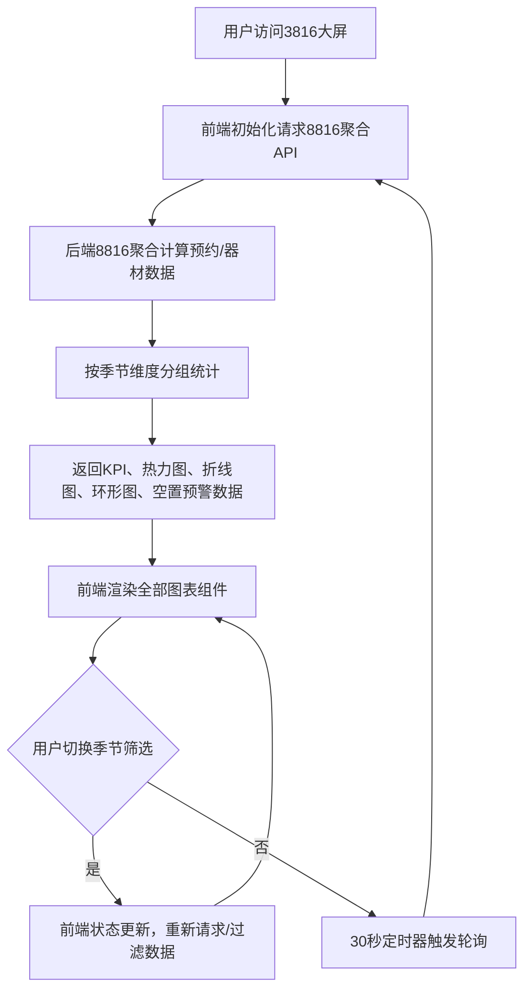

## 1. 产品概述

天文观测站运营数据可视化大屏系统，面向观测站管理层和运营人员，提供预约数据、器材使用数据的实时聚合展示与分析。系统采用前后端分离架构，后端服务（端口8816）负责数据聚合计算，前端大屏（端口3816）以全屏可视化方式呈现核心运营指标。

- 核心目标：通过数据可视化驱动运营决策，优化观测点位资源配置
- 目标用户：观测站运营管理人员、决策层
- 核心价值：直观展示客流趋势、器材使用分布、热门点位与空置预警

## 2. 核心功能

### 2.1 用户角色

| 角色 | 注册方式 | 核心权限 |
|------|----------|----------|
| 运营管理员 | 系统预置 | 全屏查看大屏数据、切换季节筛选、查看空置预警 |

### 2.2 功能模块

1. **大屏首页**：顶部运营KPI指标、四季切换筛选器、核心图表区域
2. **地图热力图模块**：中国地图/区域地图叠加热力，展示热门观测点位分布
3. **客流趋势模块**：折线图展示12个月客流起伏变化，支持四季数据叠加对比
4. **器材租借模块**：环形图统计各类望远镜租借占比分布
5. **空置预警模块**：自动标黄长期空置观测点位，提供运营调整提醒

### 2.3 页面详情

| 页面名称 | 模块名称 | 功能描述 |
|----------|----------|----------|
| 大屏首页 | KPI指标区 | 展示总预约数、总客流、器材使用率、活跃点位数量等核心指标，数据实时刷新 |
| 大屏首页 | 季节筛选器 | 春/夏/秋/冬四季Tab切换，支持单选或多选叠加对比，切换后所有图表联动更新 |
| 大屏首页 | 地图热力图 | 以地理热力图形式展示各观测点位热度，颜色深浅代表访问量，悬停显示详情 |
| 大屏首页 | 月度客流折线图 | X轴为1-12月，Y轴为客流量，多条折线代表不同季节，支持图例交互 |
| 大屏首页 | 望远镜租借环形图 | 展示折射式、反射式、折反射式、射电式等各类望远镜租借占比 |
| 大屏首页 | 空置点位预警 | 列表形式展示连续空置超过阈值的点位，行背景标黄，显示空置天数和建议 |

## 3. 核心流程

用户打开大屏首页后，系统自动从8816后端聚合服务拉取全量运营数据，渲染所有图表。用户可通过顶部季节筛选器切换或叠加四季数据，所有图表实时联动刷新。系统每30秒自动轮询最新数据，长期空置点位自动标黄并置顶显示。

## 4. 用户界面设计

### 4.1 设计风格

- **主色调**：深空蓝（#0A1929）为背景主色，科技蓝（#1890FF）为强调色
- **辅助色**：热力渐变色（冷蓝→青→绿→橙→红）、预警黄（#FAAD14）
- **按钮风格**：扁平化Tab胶囊按钮，选中状态为渐变蓝边框+发光效果
- **字体**：标题使用 Orbitron（科技感等宽字体），数据数字使用 DIN Alternate，正文使用 Noto Sans SC
- **布局风格**：全屏暗黑科技风，多宫格卡片布局，卡片带渐变边框和微妙发光效果
- **动效**：数据加载数字滚动动画、图表渐入动画、空置点位呼吸闪烁提醒

### 4.2 页面设计概览

| 页面名称 | 模块名称 | UI元素 |
|----------|----------|--------|
| 大屏首页 | KPI指标区 | 4个数据卡片横向排列，大字号数字+滚动动画，图标用lucide-react |
| 大屏首页 | 季节筛选器 | 顶部中央4个季节Tab：🌸春 / ☀️夏 / 🍂秋 / ❄️冬，支持多选叠加 |
| 大屏首页 | 地图热力图 | 左侧大区域，地图带发光点，右侧图例，悬停tooltip显示点位信息 |
| 大屏首页 | 客流折线图 | 右上区域，渐变填充面积图，多季节用不同色系折线，支持图例开关 |
| 大屏首页 | 望远镜环形图 | 右中区域，环形渐变饼图，中心显示总租借数，周边带标签引线 |
| 大屏首页 | 空置点位预警 | 右下区域，表格布局，空置行背景黄色渐变，行尾闪烁预警图标 |

### 4.3 响应式

桌面大屏优先设计，基准分辨率1920×1080，适配2K/4K屏幕；最小支持1366×768，超出区域可滚动查看。所有图表使用ECharts自适应容器宽度。

### 4.4 视觉氛围

整体营造太空科技感：背景为深蓝径向渐变+微弱星点粒子动画，卡片边框带霓虹发光线，图表配色沿用深空色谱，关键数据用脉冲动画吸引注意。
