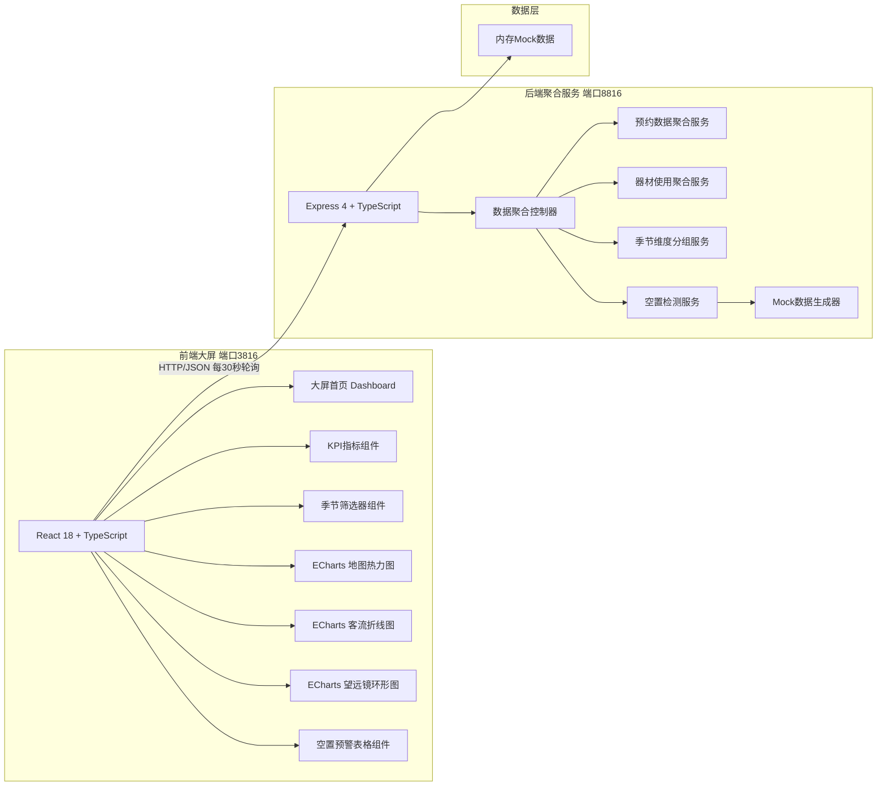
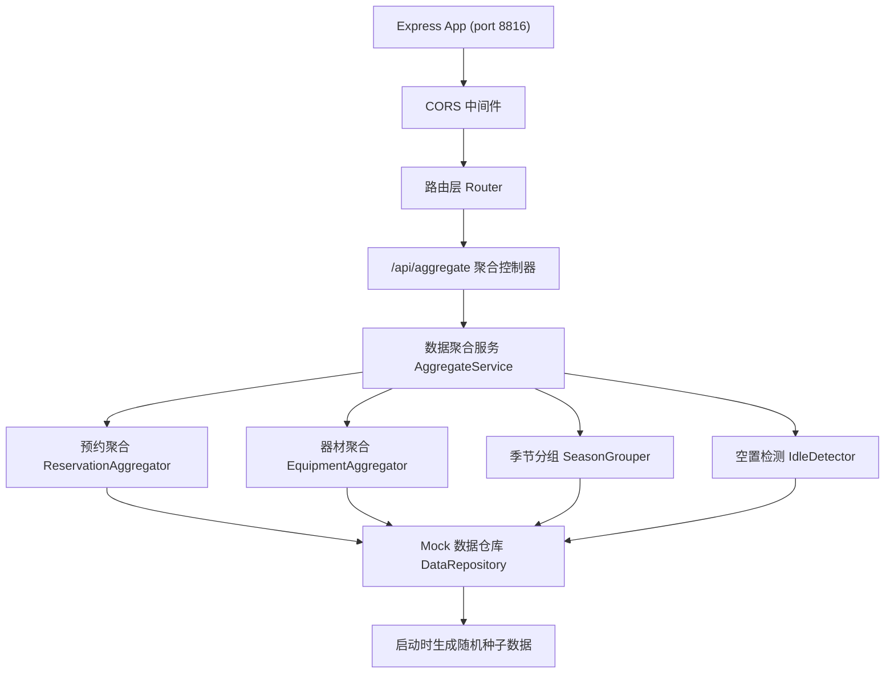

## 1. 架构设计



## 2. 技术说明

- **前端大屏**：React@18 + TypeScript + Vite + TailwindCSS@3 + Zustand + ECharts@5 + echarts-for-react + lucide-react
- **初始化工具**：vite-init (react-express-ts 模板)
- **后端聚合服务**：Express@4 + TypeScript + CORS
- **数据层**：内存 Mock 数据，由后端启动时生成并缓存，无需数据库
- **端口规划**：前端 Vite 开发服务器 3816，后端 Express 服务 8816
- **跨域处理**：后端开启 CORS 允许 3816 端口访问，前端通过 /api 代理或直接访问 8816

## 3. 路由定义

### 前端路由

| 路由 | 用途 |
|------|------|
| / | 大屏首页，全屏展示所有可视化组件 |

### 后端 API 路由

| 路由 | 方法 | 用途 |
|------|------|------|
| /api/aggregate | GET | 获取全量聚合数据（KPI+热力图+折线图+环形图+空置预警），支持 seasons 查询参数筛选季节 |
| /api/aggregate/kpi | GET | 获取KPI指标数据 |
| /api/aggregate/heatmap | GET | 获取地图热力图数据 |
| /api/aggregate/trend | GET | 获取月度客流折线图数据 |
| /api/aggregate/telescope | GET | 获取望远镜租借占比数据 |
| /api/aggregate/idle | GET | 获取空置点位预警数据 |
| /api/health | GET | 健康检查 |

## 4. API 定义

### 聚合数据请求/响应

```typescript
// seasons 查询参数：可选，数组形式如 spring,summer,autumn,winter
// GET /api/aggregate?seasons=spring,summer

interface AggregateResponse {
  kpi: KPIData;
  heatmap: HeatmapPoint[];
  trend: TrendData;
  telescope: TelescopeItem[];
  idleWarnings: IdlePoint[];
  generatedAt: string;
}

interface KPIData {
  totalReservations: number;        // 总预约数
  totalVisitors: number;            // 总客流
  equipmentUsageRate: number;       // 器材使用率 (%)
  activePoints: number;             // 活跃点位数量
  totalPoints: number;              // 点位总数
  seasonBreakdown: Record<Season, { reservations: number; visitors: number }>;
}

type Season = 'spring' | 'summer' | 'autumn' | 'winter';

interface HeatmapPoint {
  id: string;
  name: string;            // 点位名称
  value: [number, number, number]; // [经度, 纬度, 热度值]
  province: string;
  seasonData: Record<Season, number>;
  lastActiveDate: string;
}

interface TrendData {
  months: string[];        // ['1月','2月',...,'12月']
  seasons: Record<Season, number[]>; // 各季节每月客流数组
}

interface TelescopeItem {
  name: string;            // 望远镜类型：折射式/反射式/折反射式/射电式/其他
  count: number;           // 租借次数
  percentage: number;      // 占比 (%)
  color: string;
}

interface IdlePoint {
  id: string;
  name: string;
  location: string;
  idleDays: number;        // 连续空置天数
  lastReservation: string; // 上次预约日期
  suggestion: string;      // 运营调整建议
  severity: 'warning' | 'danger';
}
```

## 5. 服务端架构图



## 6. 项目目录结构

```
.
├── src/                          # 前端源码 (port 3816)
│   ├── components/
│   │   ├── dashboard/
│   │   │   ├── KPICards.tsx      # KPI指标卡片组
│   │   │   ├── SeasonFilter.tsx  # 四季筛选器
│   │   │   ├── HeatmapChart.tsx  # 地图热力图
│   │   │   ├── TrendLineChart.tsx # 客流折线图
│   │   │   ├── TelescopePieChart.tsx # 望远镜环形图
│   │   │   └── IdleWarningTable.tsx  # 空置预警表
│   │   └── ui/
│   │       └── DataCard.tsx      # 通用数据卡片
│   ├── pages/
│   │   └── Dashboard.tsx         # 大屏首页
│   ├── hooks/
│   │   └── useAggregateData.ts   # 数据轮询hook
│   ├── store/
│   │   └── dashboardStore.ts     # Zustand状态
│   ├── utils/
│   │   └── numberAnim.ts         # 数字滚动动画
│   ├── types/
│   │   └── index.ts              # 前端类型
│   ├── App.tsx
│   ├── main.tsx
│   └── index.css
├── api/                          # 后端源码 (port 8816)
│   ├── index.ts                  # Express入口
│   ├── routes/
│   │   └── aggregate.ts          # 聚合路由
│   ├── services/
│   │   ├── aggregateService.ts   # 聚合主服务
│   │   ├── dataRepository.ts     # Mock数据仓库
│   │   └── idleDetector.ts       # 空置检测
│   └── types/
│       └── index.ts              # 后端类型
├── shared/                       # 前后端共享类型
│   └── types.ts
├── package.json
├── vite.config.ts                # 配置 server.port=3816, proxy /api -> 8816
├── tsconfig.json
├── tailwind.config.js
└── postcss.config.js
```

## 7. 关键技术决策

1. **图表库选型**：ECharts@5，支持热力图、地图、折线、饼图全套可视化，echarts-for-react 封装便于React使用
2. **地图数据**：使用 ECharts 内置中国地图 GeoJSON，或通过 CDN 加载简化版中国地图
3. **季节筛选**：前端 Zustand 管理选中季节数组，支持多选叠加，变化时触发重新请求或前端过滤
4. **数据轮询**：自定义 useAggregateData hook，setInterval 每30秒调用，组件卸载自动清理
5. **空置判定规则**：连续空置 ≥15 天标记为 warning（黄），≥30 天标记为 danger（深红）
6. **无导入导出**：严格遵守需求，仅提供页面筛选，不生成任何文件下载/上传入口
7. **全屏适配**：body 设置 100vh 固定高度，使用 CSS Grid 布局所有卡片，`min-height: 0` 防溢出
